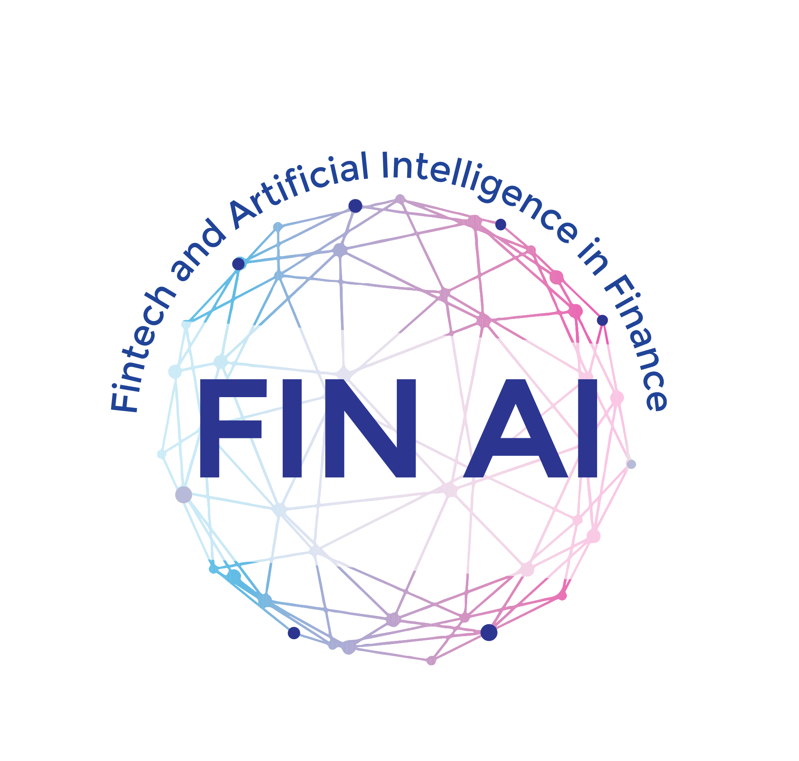

# COST FinAI Agenda &amp; Infos  

## FinAI
The financial sector is the largest user of digital technologies and a major driver in the digital transformation of the economy. Financial technology (FinTech) aims to both compete with and support the established financial industry in the delivery of financial services. Globally, more than $100 billion of investments have been made into FinTech companies and Artificial Intelligence (AI) since 2010, and continue growing substantially. In early 2018, the European Commission unveiled (a) their action plan for a more competitive and innovative financial market and (b) an initiative on AI with the aim to harness the opportunities presented by technology-enabled innovations. Europe should become a global hub for FinTech, with the economy being able to benefit from the European Single Market.

## Objectives
The Action will investigate AI and Fintech from three different angles: Transparency in FinTech, Transparent versus Black Box Decision-Support Models in the Financial Industry, and Transparency into Investment Product Performance for Clients. The Action will bridge the gap between academia, industry, the public, and governmental organizations by working in an interdisciplinary way across Europe and focusing on innovation.

:point_right: Find out more about our Action [here](https://fin-ai.eu/).

## Join our Action
If you are interested in our Action, and would like to join and contribute, please get in touch, following the steps [here defined](https://wiki.fin-ai.eu/index.php/How_to_join). More information on participating in COST Actions, can be found [here](https://www.cost.eu/cost-actions/how-to-participate/).

Join the [Fintech and AI meet-up group](https://www.meetup.com/Fintech_AI_in_Finance/) and attend one of our COST events, e.g. the weekly virtual coffee session.